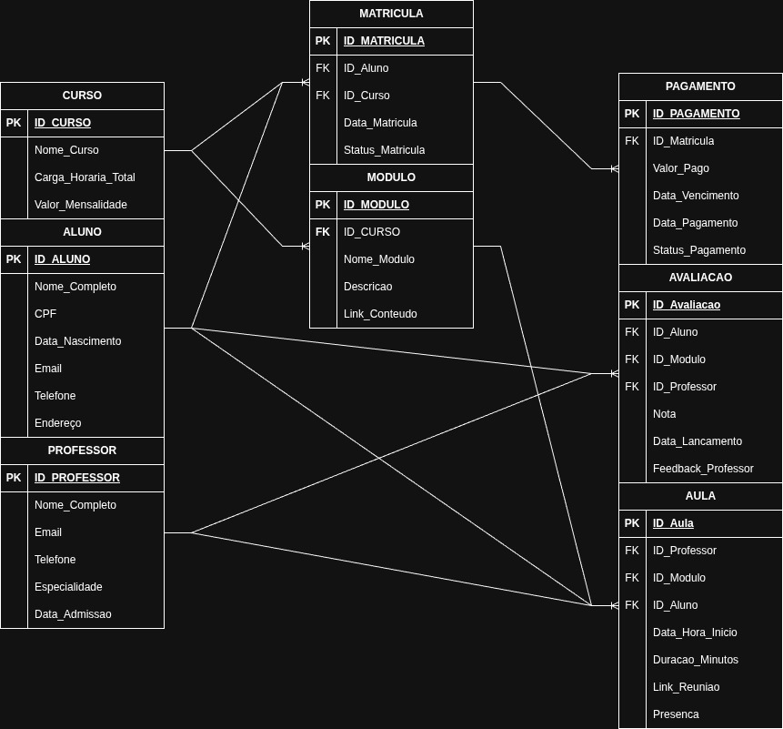

# 📚 Projeto: Sistema de Gestão Acadêmica (SGA) - Polyglot Academy

Este repositório contém os scripts SQL para a implementação e manipulação do banco de dados relacional da Polyglot Academy.

---

## 💻 1. Ambiente e Tecnologias

* **SGBD:** MySQL / MariaDB (via XAMPP)
* **Cliente SQL:** VSCode (Extensão MySQL)
* **Linguagem:** SQL (DDL e DML)

## 📊 2. Modelo Lógico Implementado

O projeto utiliza 8 tabelas interligadas, representando o ciclo de vida do aluno na academia (Matrícula, Aulas, Pagamentos e Avaliações).

### Diagrama Entidade-Relacionamento (DER)

Este diagrama representa a estrutura lógica do banco de dados, mostrando as entidades e seus relacionamentos (1:N e N:M).

## 🚀 3. Instruções de Execução

Para rodar o projeto, siga esta ordem de execução:

1.  **Conexão:** Garanta que seu servidor MySQL (XAMPP) está ativo na porta 3306 e que a conexão `root` está configurada no seu cliente SQL.
2.  **DDL (Estrutura):** Execute o arquivo `01_estrutura_ddl.sql` para criar o banco de dados `polyglot_academy` e todas as 8 tabelas.
3.  **DML (Povoamento):** Execute o arquivo `02_povoamento_dml.sql` para inserir todos os dados de teste (INSERT).
4.  **DML (Consultas):** Execute o arquivo `03_consultas_dml.sql` para visualizar as consultas complexas (SELECT).
5.  **DML (Manutenção):** Execute o arquivo `04_manutencao_dml.sql` para aplicar os comandos de atualização e exclusão (UPDATE e DELETE).

---

## 💾 4. Detalhes dos Scripts

* **01_estrutura_ddl.sql:** Contém a definição das chaves primárias e estrangeiras.
* **02_povoamento_dml.sql:** Povoa todas as tabelas, incluindo 2 registros de Avaliação (Notas).
* **03_consultas_dml.sql:** Contém 4 consultas complexas (JOIN, WHERE, ORDER BY, GROUP BY).
* **04_manutencao_dml.sql:** Contém 3 comandos UPDATE e 3 comandos DELETE com condições.
